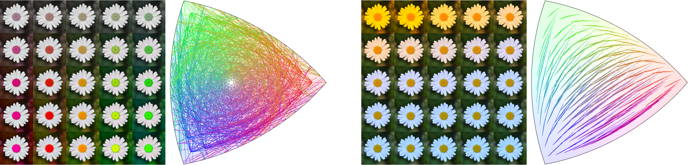

# Planckian Jitter data augmentation



Official implementation of the code from ["Planckian jitter: enhancing the color quality of self-supervised visual
representations"](https://arxiv.org/abs/2202.07993).

Code written in Pytorch v1.8.1.

Dependecies
- Pillow==7.2.0
- numpy==1.19.5
- torch==1.8.1

Example usage with other torchvision trasforms:

```
import torchvision.transforms as tranforms

from planckianTransforms import PlanckianJitter

data_transforms = [
            transforms.RandomResizedCrop(size=self.input_height),
            transforms.RandomHorizontalFlip(p=0.5),
            transforms.RandomVerticalFlip(p=0.5),
            transforms.RandomApply([PlanckianJitter(mode="blackbody")], p=0.8),
        ]
    
img_out = data_transforms(img)
```

Two parameters can be passed to the transform:
- mode: choose between BlackBody points sampling or CIED. \[Default is BlackBody\]
- idx: if idx is provided a specific illuminant is used instead of a random one from the sampled list.

```
PlanckianJitter(mode="blackbody")
# randomly selects an illuminant from the BlackBody list.

PlanckianJitter(mode="cied")
# randomly selects an illuminant from the CIED list.

PlanckianJitter(mode="blackbody", idx=5)
# selects the illuminant at index 5 of the BlackBody list.
```

## Reference
If you are going to use this code please cite us:
```
@article{zini2022planckian,
  title={Planckian jitter: enhancing the color quality of self-supervised visual representations},
  author={Zini, Simone and Buzzelli, Marco and Twardowski, Bart{\l}omiej and van de Weijer, Joost},
  journal={arXiv preprint arXiv:2202.07993},
  year={2022}
}
```

## License

MIT


